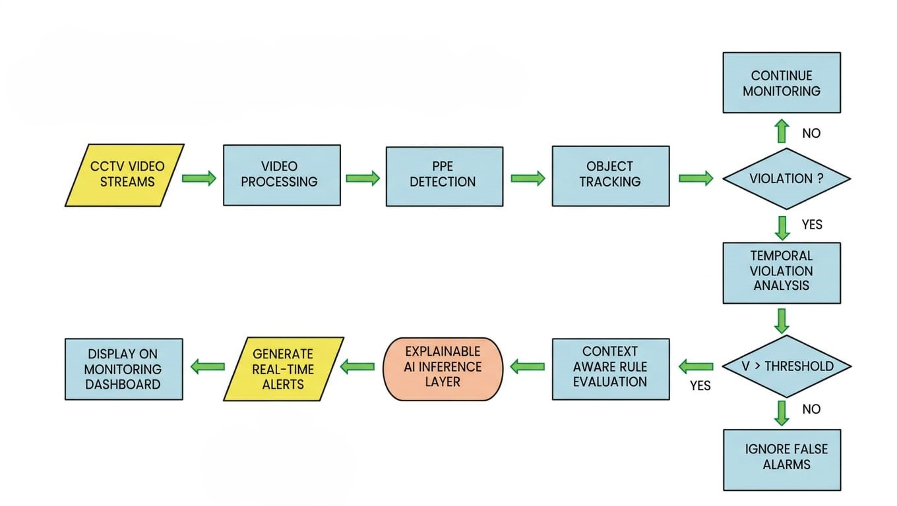
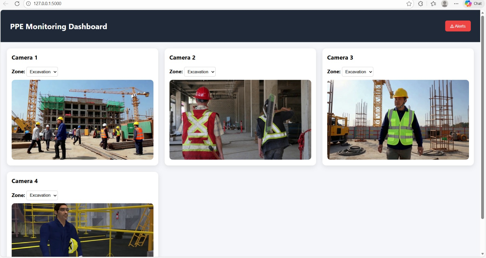
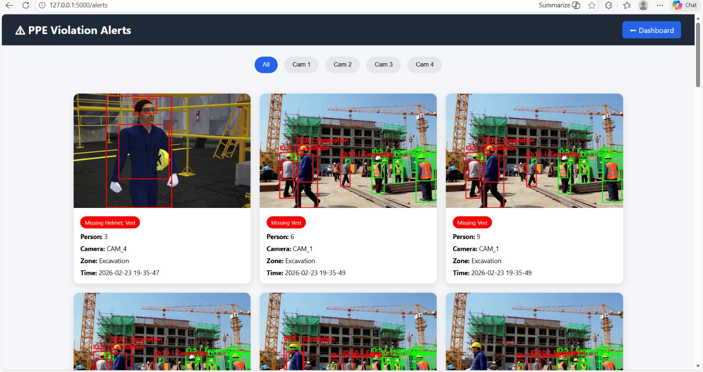
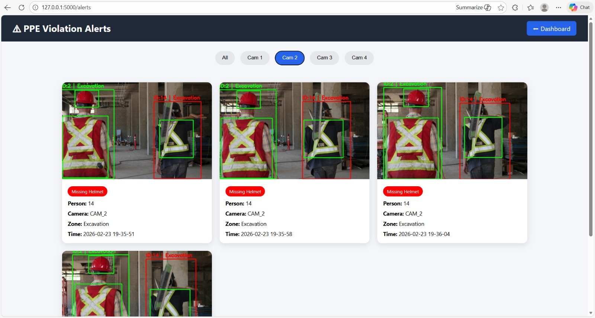
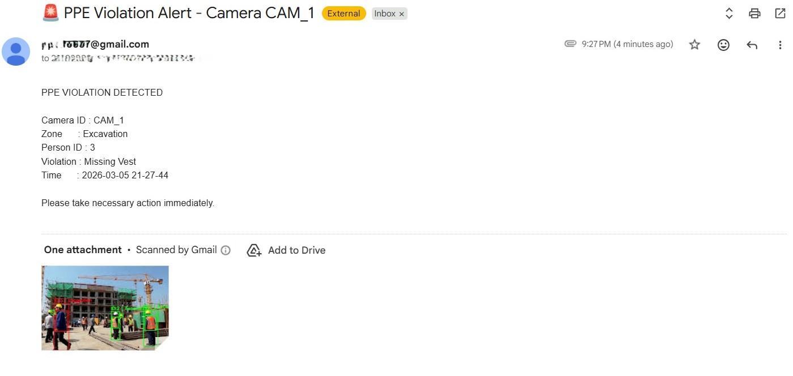
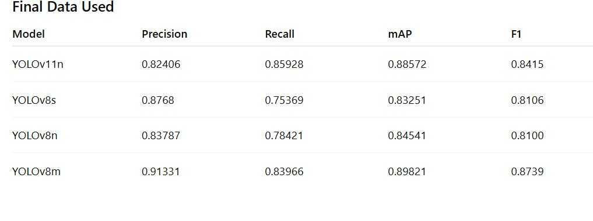
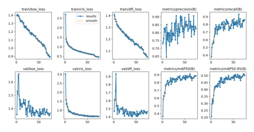
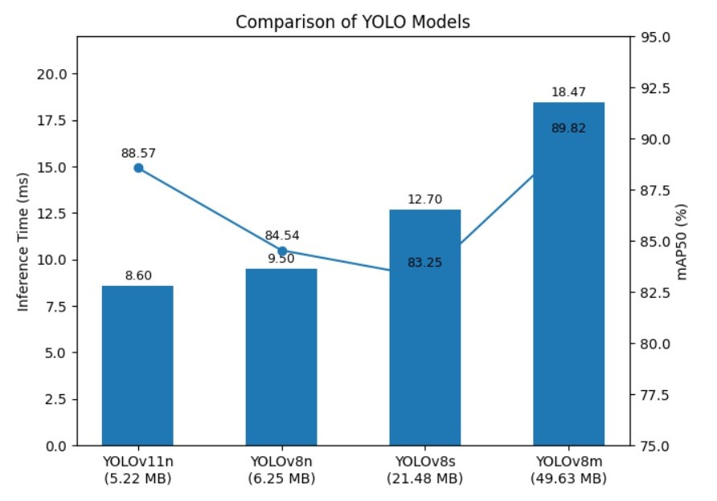
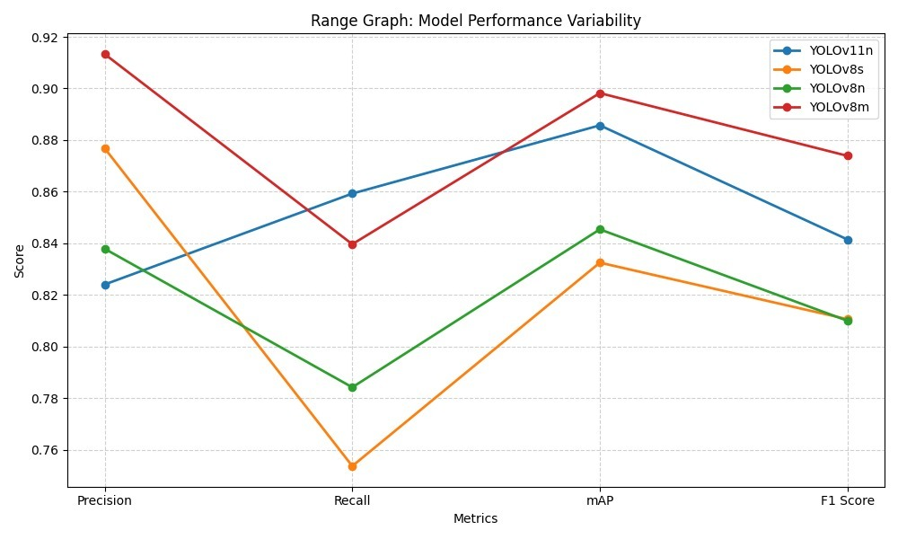

# 🦺 Design and Performance Evaluation of a Real-Time Multi-Camera PPE Compliance Monitoring Framework Using Lightweight YOLO Models

> **An IEEE Published AI-powered surveillance system for automated Personal Protective Equipment (PPE) compliance monitoring across multiple CCTV cameras using lightweight YOLO models, object tracking, contextual rule evaluation, temporal filtering, and real-time alert generation.**

---


---

# 📄 IEEE Publication

This project has been published in **IEEE Xplore**.

**Title**

> Design and Performance Evaluation of a Real-Time Multi-Camera PPE Compliance Monitoring Framework Using Lightweight YOLO Models

**Conference**

International Conference on Sustainable Engineering, Digital Innovation and Intelligent Systems (ICSEDIS 2026)

**IEEE Xplore**

https://ieeexplore.ieee.org/document/11517930

---

# 📌 Overview

Construction sites are among the most hazardous work environments where non-compliance with Personal Protective Equipment (PPE) regulations can lead to severe accidents.

This project presents an AI-powered real-time PPE compliance monitoring framework capable of simultaneously monitoring multiple CCTV streams using lightweight YOLO object detection models. The system detects helmets and safety vests, tracks individuals across frames, evaluates contextual safety rules based on work zones, performs temporal violation analysis to minimize false alarms, and generates real-time dashboard notifications along with automated email alerts.

The framework was experimentally evaluated using multiple lightweight YOLO models (YOLOv8n, YOLOv8s, YOLOv8m, and YOLOv11n), providing a balance between inference speed and detection performance suitable for deployment on resource-constrained edge devices.

---

# ✨ Key Features

- 🎥 Simultaneous monitoring of multiple CCTV camera streams.
- 🦺 Real-time PPE detection for safety helmets and reflective safety vests.
- 🧠 Lightweight YOLOv8 and YOLOv11 model evaluation and comparison.
- 👥 Multi-object tracking using ByteTrack.
- 📍 Context-aware safety rule evaluation based on work zones.
- ⏱️ Temporal violation analysis to reduce false positives.
- 🚨 Real-time violation dashboard with alert history.
- 📧 Automatic email notifications with captured evidence.
- 📊 Performance benchmarking across multiple YOLO models.
- ⚡ Optimized for real-time edge deployment.

---

# 🏗️ System Architecture

The overall workflow of the proposed PPE compliance monitoring framework is illustrated below.

<p align="center">
    
</p>

### Workflow

1. CCTV video streams are captured.
2. Frames are processed in real time.
3. PPE objects are detected using YOLO.
4. ByteTrack assigns unique IDs to workers.
5. Context-aware safety rules are evaluated.
6. Temporal filtering suppresses false alarms.
7. Violations are recorded.
8. Dashboard and email notifications are generated.

---

# 🖥️ Monitoring Dashboard

The dashboard enables operators to monitor multiple camera feeds simultaneously while dynamically assigning work zones.

<p align="center">
    
</p>

### Dashboard Features

- Live camera feeds
- Zone selection
- Real-time detection
- Worker tracking
- Violation visualization
- Navigation to alert history


---

# 🚨 Alert Management

Whenever a worker violates PPE compliance rules, the framework captures the evidence and stores it inside the alert dashboard.

### All Camera Alerts

<p align="center">
    
</p>

### Camera-wise Filtering

<p align="center">
    
</p>

Each alert includes:

- Camera ID
- Worker ID
- Zone
- Timestamp
- PPE violation type
- Snapshot evidence

---

# 📧 Automated Email Alerts

<p align="center">
    
</p>

Whenever a PPE violation exceeds the configured temporal threshold, the system automatically sends an email notification containing:

- Camera ID
- Worker ID
- Zone
- Violation Type
- Timestamp
- Captured Evidence

---

# 🛠️ Technology Stack

| Category | Technologies |
|----------|--------------|
| Programming Language | Python 3.13 |
| Deep Learning | Ultralytics YOLOv11, YOLOv8 |
| Computer Vision | OpenCV |
| Object Tracking | ByteTrack |
| Backend Framework | Python |
| Frontend | HTML5, CSS3, JavaScript |
| Data Processing | NumPy, Pandas |
| Visualization | Matplotlib |
| Email Service | SMTP (Python smtplib) |
| Development Environment | Visual Studio Code |

---

# 📈 Model Performance Evaluation

Four lightweight YOLO models were trained and evaluated to identify the best balance between detection accuracy and inference speed for real-time deployment.

## Performance Comparison

<p align="center">
    
</p>

## Training Curves

<p align="center">
    
</p>

## Accuracy vs Inference Speed

<p align="center">
    
</p>

## Metric Comparison

<p align="center">
    
</p>

### Key Findings

- YOLOv11n achieved the highest recall among lightweight models.
- YOLOv8m produced the highest overall accuracy but with increased inference time.
- YOLOv8n offered an excellent balance between model size, latency, and detection performance.
- Lightweight models enable deployment on resource-constrained edge devices while maintaining reliable PPE detection.

---

# 📂 Project Structure

```text
CcTv Dashboard
│
├── backend/
│   ├── app.py
│   ├── alerts.py
│   ├── email_service.py
│   ├── templates/
│   └── static/
│
├── models/
│   ├── best.pt
│   └── yolov8n.pt
│
├── screenshots/
│
├── demo/
│
├── sample_videos/
│
├── docs/
│
├── LICENSE
├── README.md
├── .gitignore
```

---

# ⚙️ Installation

## Clone the repository

```bash
git clone https://github.com/AshwinSathappan/Real-Time-Multi-Camera-PPE-Monitoring.git

cd CcTv Dashboard
```

## Install dependencies

```bash
pip install -r backend/requirements.txt
```

## Run the application

```bash
cd backend

python app.py
```

Open your browser and visit

```
http://127.0.0.1:5000
```

---

# ⚙️ Working Pipeline

1. Capture CCTV video streams.
2. Process frames in real time.
3. Detect workers and PPE using YOLO.
4. Track individuals using ByteTrack.
5. Assign contextual work zones.
6. Evaluate PPE compliance rules.
7. Apply temporal filtering to reduce false positives.
8. Store alert information.
9. Update dashboard.
10. Send automated email notifications.

---

# 🚀 Future Enhancements

- Live RTSP/IP camera integration.
- GPU-accelerated deployment.
- Multi-site centralized monitoring.
- Role-based authentication.
- SMS and WhatsApp notifications.
- PPE analytics dashboard.
- Cloud deployment.
- Mobile application support.
- Explainable AI for violation reasoning.

---

# 🎥 Demonstration

A complete walkthrough demonstrating installation, dashboard operation, zone selection, alert generation, and automated email notifications is available below.

**Demo Video:** https://drive.google.com/file/d/1s6olJYkZjKTsqIPauQ7QN6eoOrZMMVfy/view?usp=drive_link

---

# 📚 Citation

If you use this work in your research or project, please cite:

```bibtex
@inproceedings{11517930,
  author={Vellayan, Ashwin Sathappan and M, Bala and G V, Bhuvan Kalyan and P, Giridharan and G, Janani},
  booktitle={2026 International Conference on Smart Electronic Devices and Intelligent Systems (ICSEDIS)}, 
  title={Design and Performance Evaluation of a Real-Time Multi-Camera PPE Compliance Monitoring Framework using Lightweight YOLO Models}, 
  year={2026},
  volume={},
  number={},
  pages={1126-1136},
  keywords={Modeling;Signal detection;Timing;Real-time systems;Safety;Cameras;Monitoring;Streams;Construction;Accuracy;Lightweight YOLO models;PPE Detection;real-time multi-camera surveillance;construction safety;multi-object tracking;temporal violation analysis;intelligent alert system},
  doi={10.1109/ICSEDIS68157.2026.11517930}}
```

---

# 👨‍💻 Author

**Bhuvan Kalyan G V**

Information Technology Engineer

IEEE Author

AI | Computer Vision | Deep Learning | Machine Learning

